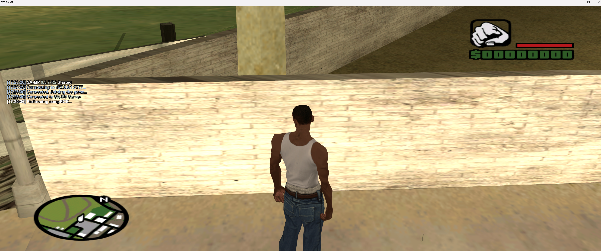
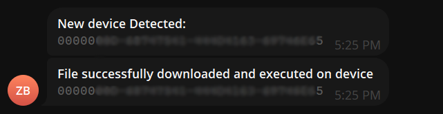

# samp-rce

Small presentation example of Remote Code Execution in SA:MP. This vulnerability is fixed in latest RC samp 0.3.7-R5 (ev&doe no one plays this version, this exploit can be used in a version that 99.5% shitskins use, which is 0.3.7-R1 (also known as 0.3.7))

this exploit can be used to launch exes onto victim's pc through a WINDOWS SAMP server, the only thing they need to do is join the server

### Requirements
#### Python ( https://www.python.org/downloads/ )
#### Visual Studio or any other C++ compiler ( Visual Studio: https://visualstudio.microsoft.com/ ignore the 'jeets when downloading )
#### GTA:SA and SA:MP ( Only for testing, you can exploit without it. )
#### SA:MP 0.3.7 R1 server for WINDOWS ONLY. ( in muh repository or anywhere else if you can find )

### Setup
* #### Download this repository
* #### Compile `src/` (cpp) project to .dll using visual studio or any other shit (Win32, RELEASE)
   - #### Note: you already have build file in dir `release/` with name `sampRCE.dll` from a third worlder that i didn't make with non longer working telegram token (which he used for testing)
     #### Edit RAW download link in `main.h` file
* #### Rename the file's extension from `.dll` to `.asi`
* #### Move the file to dir `sRDI/`
   - #### sRDI is an external tool, (You) can get it here: https://github.com/monoxgas/sRDI or via command:
     ```
     git clone https://github.com/monoxgas/sRDI   
     ```
* #### Convert to shellcode
   ```
   py .\ConvertToShellcode.py .\sampRCE.asi
   ```
   in cmd
* #### Move converted `sampRCE.asi` to `server/scriptfiles/`
* #### Run server with `sampctl run` or the samp_server.exe, now when anyone joins the server, they will get an EXE executed

### 
```
|----------|                   |---------|                                         |--------|
| samp svr | ---> [rce.pwn] -> | payload | <---> [ scriptfiles/sampRCE.asi ] ----> | client |
|----------|                   |---------|                                         |------- |
```
### demo images

#### client

#### telegram logger example


### Credits
#### big thanks to EvgeN 1137 who explained and cover this vulnerability you can check his post [here](https://www.blast.hk/threads/204306/)
### Disclamer
This repository is for academic purposes, the use of this software is your responsibility.
